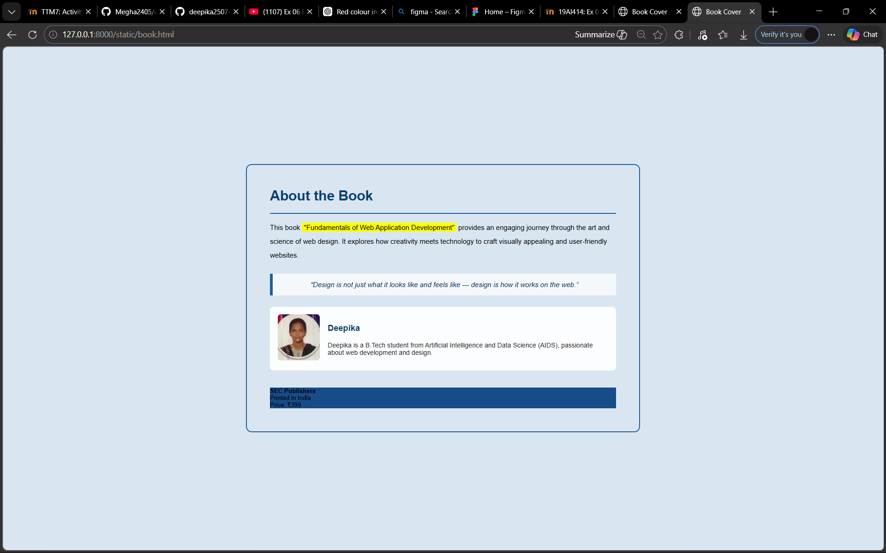

# Ex.05 Book Front Cover Page Design
## Date:

## AIM:
To design a book front cover page using HTML and CSS.

## DESIGN STEPS:

### Step 1:
Create a Django Admin project.

### Step 2:
Create an app in the Django interface.

### Step 3:
Create a folder named 'static' in the app folder.

### Step 4:
Create a new HTML file in the static folder.

### Step 5:
Write the HTML code with relevant CSS properties.

### Step 6:
Choose the appropriate style and color scheme.

### Step 7:
Insert the images in their appropriate places.

### Step 8:
Publish the website in the LocalHost.

## PROGRAM:
book.html
```
<!DOCTYPE html>
<html lang="en">
<head>
    <meta charset="UTF-8">
    <title>Book Cover</title>
    <link rel="stylesheet" href="style.css">
</head>
<body>

<div class="cover">

    <h1>About the Book</h1>
    <hr>

    <p class="description">
        This book <span class="highlight">"Fundamentals of Web Application Development"</span>
        provides an engaging journey through the art and science of web design.
        It explores how creativity meets technology to craft visually appealing
        and user-friendly websites.
    </p>

    <div class="quote">
        “Design is not just what it looks like and feels like — design is how it works on the web.”
    </div>

    <div class="author-box">
        

        <div>
            <h3>Deepika</h3>
            <p>
                Deepika is a B.Tech student from Artificial Intelligence and Data Science (AIDS),
                passionate about web development and design.
            </p>
        </div>
    </div>

    <div class="footer">
        <div>
            <strong>SEC Publishers</strong><br>
            Printed in India
        </div>
        <div class="price">Price: ₹399</div>
    </div>

</div>

</body>
</html>
```
style.css
```
body{
    margin:0;
    height:100vh;
    display:flex;
    justify-content:center;
    align-items:center;
    background:#d9e6f2;
    font-family: Arial, sans-serif;
}


.cover{
    width:900px;              
    padding:60px;
    border-radius:15px;
    border:3px solid #1f5f9c;
    background-image:url("sky.png");
    background-size:cover;
    background-position:center;
}

h1{
    margin-top:0;
    font-size:36px;
    color:#0b3d6e;   /* heading color */
}

hr{
    border:2px solid #1f5f9c;
}


.description{
    line-height:2;
    font-size:18px;
    color:#000000;   /* paragraph color */
}

.highlight{
    background:yellow;
    padding:2px 5px;
}


.quote{
    margin:30px 0;
    padding:18px;
    background:rgba(255,255,255,0.7);
    border-left:8px solid #1f5f9c;
    text-align:center;
    font-style:italic;
    font-size:18px;
    color:#0a2e57;
}


.author-box{
    display:flex;
    gap:20px;
    background:rgba(255,255,255,0.9);
    padding:20px;
    border-radius:10px;
}

.author-box img{
    width:110px;      /* bigger photo */
    height:120px;
    object-fit:cover;
    border-radius:8px;
}

.author-box h3{
    font-size:22px;
    color:#0b3d6e;
}

.author-box p{
    font-size:17px;
    color:#222;
}


.footer{
    margin-top:45px;
    background:#174c88;
    color

```

## OUTPUT:


## RESULT:
The program for designing book front cover page using HTML and CSS is completed successfully.
